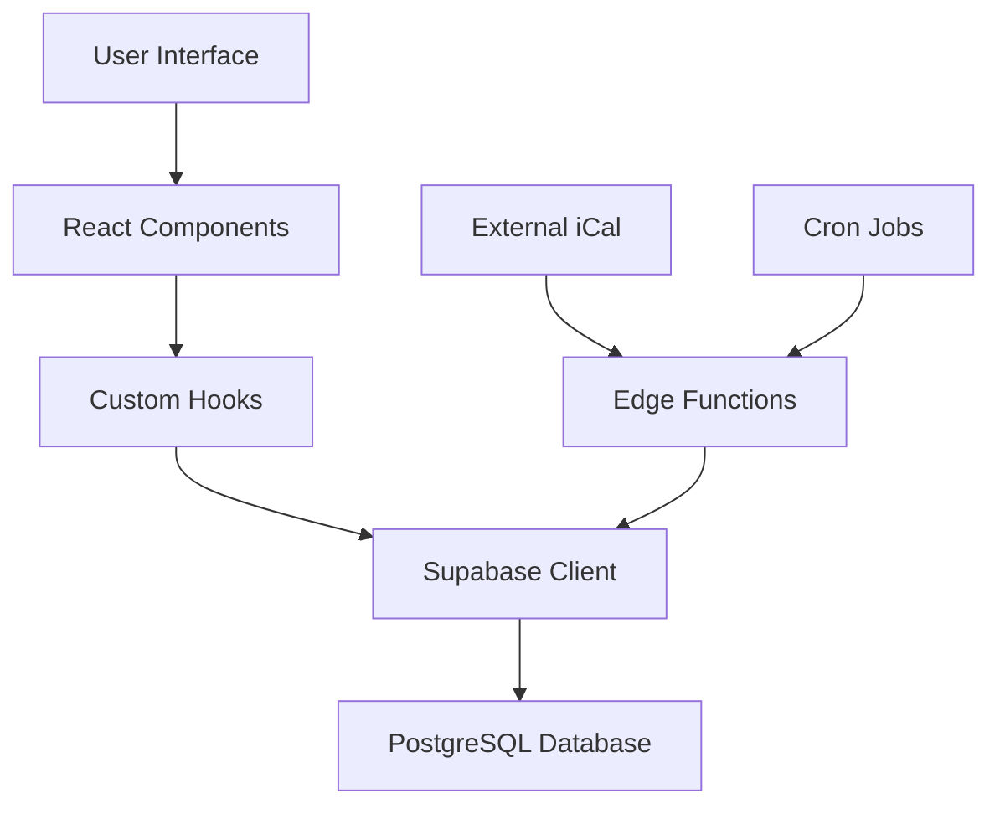

# Welcome to your Lovable project

## Project info

**URL**: https://lovable.dev/projects/be28d10b-bb71-4898-a716-b5f0d8a66736

## How can I edit this code?

There are several ways of editing your application.

**Use Lovable**

Simply visit the [Lovable Project](https://lovable.dev/projects/be28d10b-bb71-4898-a716-b5f0d8a66736) and start prompting.

Changes made via Lovable will be committed automatically to this repo.

**Use your preferred IDE**

If you want to work locally using your own IDE, you can clone this repo and push changes. Pushed changes will also be reflected in Lovable.

The only requirement is having Node.js & npm installed - [install with nvm](https://github.com/nvm-sh/nvm#installing-and-updating)

Follow these steps:

```sh
# Step 1: Clone the repository using the project's Git URL.
git clone <YOUR_GIT_URL>

# Step 2: Navigate to the project directory.
cd <YOUR_PROJECT_NAME>

# Step 3: Install the necessary dependencies.
npm i

# Step 4: Start the development server with auto-reloading and an instant preview.
npm run dev
```

**Edit a file directly in GitHub**

- Navigate to the desired file(s).
- Click the "Edit" button (pencil icon) at the top right of the file view.
- Make your changes and commit the changes.

**Use GitHub Codespaces**

- Navigate to the main page of your repository.
- Click on the "Code" button (green button) near the top right.
- Select the "Codespaces" tab.
- Click on "New codespace" to launch a new Codespace environment.
# 🏛️ Assisi B&B Booking System

**Sistema completo di prenotazione per B&B con sincronizzazione automatica calendari esterni, gestione admin avanzata e ottimizzazione same-day turnover.**

## 📋 Indice

- [🎯 Overview](#-overview)
- [🚀 Quick Start](#-quick-start)
- [🛠️ Tech Stack](#️-tech-stack)
- [🏗️ Architettura Sistema](#️-architettura-sistema)
- [🎨 Frontend Features](#-frontend-features)
- [💼 Admin System](#-admin-system)
- [📅 Booking System](#-booking-system)
- [🔄 iCal Sync Automation](#-ical-sync-automation)
- [🏠 Database Schema](#-database-schema)
- [⚡ Hooks System](#-hooks-system)
- [🧩 Componenti Principali](#-componenti-principali)
- [🔧 Configurazione](#-configurazione)
- [🚀 Deployment](#-deployment)
- [🐛 Troubleshooting](#-troubleshooting)
- [📈 Performance](#-performance)
- [🤝 Contributing](#-contributing)

---

## 🎯 Overview

Sistema di prenotazione per B&B costruito con React/TypeScript e Supabase, ottimizzato per la gestione di 4 proprietà simultanee con funzionalità avanzate di same-day turnover e sincronizzazione automatica con Airbnb/Booking.com.

### ✨ Caratteristiche Principali

- **🏠 Multi-Property Management** - Gestione 4 proprietà simultanee
- **📅 Same-Day Turnover** - Ottimizzazione checkout/check-in stesso giorno
- **🔄 Auto iCal Sync** - Sincronizzazione automatica Airbnb/Booking.com
- **⚡ Real-Time Availability** - Controllo disponibilità in tempo reale
- **💰 Dynamic Pricing** - Prezzi stagionali + override personalizzati
- **👑 Admin Dashboard** - Gestione completa tramite interfaccia admin
- **📱 Mobile-First** - Design responsive ottimizzato mobile

---

## 🚀 Quick Start

### Prerequisiti
```bash
- Node.js 18+ 
- npm/yarn
- Account Supabase
- Git
```

### Installazione

```bash
# 1. Clone repository
git clone <YOUR_GIT_URL>
cd assisi-bnb-system

# 2. Installa dipendenze
npm install

# 3. Configura environment variables
cp .env.example .env.local

# 4. Avvia development server
npm run dev
```

### Environment Variables

```bash
# Supabase Configuration
VITE_SUPABASE_URL=your_supabase_url
VITE_SUPABASE_ANON_KEY=your_supabase_anon_key

# iCal Sync Configuration (Optional)
VITE_ICAL_SYNC_ENABLED=true
VITE_ICAL_PROXY_URL=your_edge_function_url
```

---

## 🛠️ Tech Stack

### Frontend Framework
- **React 18** - UI Library
- **TypeScript** - Type safety completa
- **Vite** - Build tool e dev server
- **React Router** - Routing system

### Styling & UI
- **Tailwind CSS** - Utility-first CSS framework
- **shadcn/ui** - Component library moderna
- **Lucide React** - Icon system
- **Custom Design System** - Sage, Terracotta, Stone palette

### Backend & Database
- **Supabase** - Backend as a Service
- **PostgreSQL** - Database principale
- **Supabase Auth** - Authentication system
- **Row Level Security** - Database security

### State Management & Data
- **React Query/TanStack Query** - Server state management
- **React Hooks** - Client state management
- **date-fns** - Date manipulation library
- **Zod** - Schema validation (future)

### External Integration
- **iCal.js** - Calendar parsing
- **CORS Proxy** - Edge Functions per iCal sync
- **Cron Jobs** - Automated sync scheduling

---

## 🏗️ Architettura Sistema

### Struttura Directory

```
src/
├── components/          # React components
│   ├── admin/          # Admin-only components
│   ├── booking/        # Booking system components
│   └── ui/             # Reusable UI components
├── hooks/              # Custom React hooks
├── integrations/       # External service integrations
├── pages/              # Route-based page components
├── types/              # TypeScript type definitions
├── utils/              # Utility functions
└── assets/             # Static assets (images, etc.)

supabase/
├── functions/          # Edge Functions
│   ├── ical-proxy/    # iCal download proxy
│   └── auto-ical-sync/ # Automated sync function
└── migrations/         # Database migrations
```

### Flusso Dati



---

## 🎨 Frontend Features

### Public Pages (8 pagine)

#### Homepage (`/`)
- Hero section con search widget
- Room overview cards
- Pricing dinamico
- Call-to-action ottimizzati

#### Room Pages (4 proprietà)
- **Garden Room Sanctuary** (`/garden-room`)
- **Historic Stone Vault Apartment** (`/stone-vault-apartment`) 
- **Panoramic Terrace Apartment** (`/terrace-apartment`)
- **Contemporary Luxury Apartment** (`/modern-apartment`)

**Features per room page:**
- Gallery immagini responsive
- BookingWidget integrato
- Amenities list
- Dynamic pricing display
- SEO optimization

#### Utility Pages
- **About** (`/about`) - Storia e informazioni B&B
- **Contact** (`/contact`) - Form contatto
- **Search Results** (`/search-results`) - Risultati ricerca avanzata

### Core User Flow

1. **Search & Filter System**
   - Date picker avanzato
   - Guest count selector
   - Real-time availability check
   
2. **Room Selection**
   - Dynamic pricing based on dates
   - Availability validation
   - Same-day turnover support

3. **Booking Process**
   - Multi-step form
   - Guest information collection
   - Confirmation system

---

## 💼 Admin System

### Authentication & Security

```typescript
// Protected route implementation
<ProtectedRoute>
  <AdminLayout>
    <AdminDashboard />
  </AdminLayout>
</ProtectedRoute>
```

#### Features Security:
- **Supabase Auth** integration
- **Session management** automatico
- **Row Level Security** policies
- **Admin-only route protection**

### Admin Dashboard (`/admin`)

**Sezioni principali:**
- System status overview
- Quick stats (bookings, revenue)
- Navigation menu
- Real-time updates

### Availability Management (`/admin/availability`)

```typescript
// Example usage
const { toggleAvailability, bulkUpdate } = useAvailabilityManagement('garden');

// Block single date
await toggleAvailability('2024-12-25', false);

// Bulk operations  
await bulkUpdate(['2024-12-24', '2024-12-25'], false);
```

**Features:**
- **Visual calendar interface**
- **Click-to-block/unblock** dates
- **Bulk operations** per range selection
- **Conflict detection** (non permette modifica date prenotate)
- **Real-time updates**

### Price Management (`/admin/pricing`)

```typescript
// Dynamic pricing system
const { setPriceOverride, getPriceForDate } = usePricingCalculation('terrace');

// Set custom price for specific date
await setPriceOverride('2024-12-31', 150); // €150 for New Year

// Get effective price (with override logic)
const price = getPriceForDate('2024-12-31'); // Returns €150
```

**Features:**
- **Per-date pricing** override
- **Bulk price updates**
- **Seasonal pricing** automatico (High: Jun-Sep, Low: rest)
- **Quick preset buttons** (base price, +20%, +50%, etc.)

---

## 📅 Booking System

### BookingWidget Architecture

**Componenti principali:**
- `BookingWidget.tsx` - Container principale
- `BookingCalendar.tsx` - Date selection
- `BookingForm.tsx` - Multi-step form
- Modern hooks per business logic

### Same-Day Turnover System 🚀

**BREAKTHROUGH FEATURE** - Ottimizzazione turnover stesso giorno:

```typescript
// Logic implementata in useRoomUnavailableDates.ts
const bookingDates = eachDayOfInterval({ start: checkIn, end: checkOut })
  .slice(1, -1); // Remove BOTH check-in AND checkout day
```

**Esempio pratico:**
- **Prenotazione:** 15-17 ottobre
- **Calendar blocca:** Solo `[16]` (notte effettiva)
- **Disponibili:** 15 ottobre (check-in altri) + 17 ottobre (check-in nuovi)

**Benefici:**
- **+33% disponibilità** date
- **Revenue optimization** massima
- **User experience** ottimizzata

### Conflict Detection System

```typescript
// Triple-layer conflict detection
const { checkAvailability } = useAvailabilityCheck();

const result = await checkAvailability('garden', checkIn, checkOut);
// Checks: 
// 1. Existing bookings (overlap detection)
// 2. Manual availability blocks  
// 3. External calendar conflicts (iCal)
```

### Booking Flow

1. **Date Selection** - Calendar con unavailable dates
2. **Availability Check** - Real-time validation
3. **Pricing Calculation** - Dynamic con override
4. **Guest Information** - Multi-step form
5. **Confirmation** - Booking number generation

---

## 🔄 iCal Sync Automation

Sistema automatico sincronizzazione calendari esterni (Airbnb, Booking.com).

### Architecture

```
External Calendar → Edge Function → Database → UI Update
     (iCal URL)    →  (CORS Proxy)  → (room_availability) → (Real-time)
```

### useICalSync Hook

```typescript
const { 
  syncAllCalendars,
  processAutomaticSync,
  downloadICalData,
  parseICalEvents 
} = useICalSync();

// Manual sync all configs
await syncAllCalendars();

// Automated sync (cron job)
await processAutomaticSync();
```

### Edge Functions

#### 1. ical-proxy (`/functions/ical-proxy`)
```typescript
// CORS bypass per external calendars
const response = await fetch(icalUrl, {
  headers: { 'User-Agent': 'Mozilla/5.0...' }
});
```

#### 2. auto-ical-sync (`/functions/auto-ical-sync`)
```typescript
// Automated sync triggered by cron
// Runs every 12 hours (6 AM/6 PM UTC)
const pendingConfigs = await getPendingConfigs();
for (const config of pendingConfigs) {
  await syncSingleConfig(config);
}
```

### Configuration Management

**Database table:** `room_ical_configs`
- `room_id` - Property identifier  
- `platform` - Airbnb, Booking.com, etc.
- `ical_url` - External calendar URL
- `sync_interval_hours` - Frequency (default: 12)
- `is_active` - Enable/disable sync

### Automated Scheduling

**Cron Job Configuration:**
```sql
-- Supabase cron extension
SELECT cron.schedule(
  'auto-ical-sync',
  '0 6,18 * * *', -- Every day at 6 AM and 6 PM UTC
  'SELECT net.http_post(url => ''your-edge-function-url'');'
);
```

### Features

- **Multi-platform support** - Airbnb, Booking.com, VRBO, etc.
- **Error handling & retry logic** - Resiliente a network issues
- **Batch processing** - Optimized database insertions (100 records/batch)
- **Progress tracking** - Real-time UI feedback
- **Zero maintenance** - Hands-off automated operation

---

## 🏠 Database Schema

### Core Tables (5 tables)

#### `rooms` - Property Master Data
```sql
CREATE TABLE rooms (
  id TEXT PRIMARY KEY,
  name TEXT NOT NULL,
  slug TEXT UNIQUE NOT NULL,
  base_price INTEGER NOT NULL,
  high_season_price INTEGER NOT NULL,
  capacity INTEGER NOT NULL,
  description TEXT,
  short_description TEXT,
  amenities JSONB,
  features JSONB,
  images JSONB,
  is_active BOOLEAN DEFAULT true,
  created_at TIMESTAMP DEFAULT NOW()
);
```

#### `bookings` - Guest Reservations
```sql
CREATE TABLE bookings (
  id UUID PRIMARY KEY DEFAULT uuid_generate_v4(),
  room_id TEXT REFERENCES rooms(id),
  check_in DATE NOT NULL,
  check_out DATE NOT NULL,
  guest_name TEXT NOT NULL,
  guest_email TEXT NOT NULL,
  guest_phone TEXT,
  guest_country TEXT,
  guests_count INTEGER NOT NULL,
  total_nights INTEGER NOT NULL,
  total_price INTEGER NOT NULL,
  special_requests TEXT,
  status TEXT CHECK (status IN ('pending','confirmed','cancelled')) DEFAULT 'confirmed',
  created_at TIMESTAMP DEFAULT NOW()
);
```

#### `room_availability` - Availability & Pricing
```sql
CREATE TABLE room_availability (
  id UUID PRIMARY KEY DEFAULT uuid_generate_v4(),
  room_id TEXT REFERENCES rooms(id),
  date DATE NOT NULL,
  is_available BOOLEAN NOT NULL DEFAULT true,
  price_override INTEGER, -- Custom price for specific date
  created_at TIMESTAMP DEFAULT NOW(),
  UNIQUE(room_id, date)
);
```

#### `room_ical_configs` - External Calendar Settings
```sql
CREATE TABLE room_ical_configs (
  id UUID PRIMARY KEY DEFAULT uuid_generate_v4(),
  room_id TEXT REFERENCES rooms(id),
  platform TEXT NOT NULL, -- 'airbnb', 'booking', 'vrbo', etc.
  ical_url TEXT NOT NULL,
  is_active BOOLEAN DEFAULT true,
  sync_interval_hours INTEGER DEFAULT 12,
  last_sync_at TIMESTAMP,
  last_sync_status TEXT, -- 'success', 'error'
  created_at TIMESTAMP DEFAULT NOW()
);
```

#### `ical_auto_sync_status` - Sync Monitoring
```sql
CREATE TABLE ical_auto_sync_status (
  id UUID PRIMARY KEY DEFAULT uuid_generate_v4(),
  sync_run_id TEXT NOT NULL,
  total_configs INTEGER,
  successful_syncs INTEGER,
  failed_syncs INTEGER,
  execution_time_ms INTEGER,
  sync_timestamp TIMESTAMP DEFAULT NOW()
);
```

### Indexes & Performance

```sql
-- Critical indexes for performance
CREATE INDEX idx_bookings_room_dates ON bookings(room_id, check_in, check_out);
CREATE INDEX idx_availability_room_date ON room_availability(room_id, date);
CREATE INDEX idx_ical_configs_active ON room_ical_configs(is_active, last_sync_at);
```

### Row Level Security (RLS)

```sql
-- Public read access for rooms and availability
ALTER TABLE rooms ENABLE ROW LEVEL SECURITY;
CREATE POLICY "Public rooms access" ON rooms FOR SELECT USING (is_active = true);

-- Admin-only access for bookings
ALTER TABLE bookings ENABLE ROW LEVEL SECURITY;
CREATE POLICY "Admin bookings access" ON bookings FOR ALL USING (auth.role() = 'authenticated');
```

---

## ⚡ Hooks System

Architettura modulare basata su custom hooks riutilizzabili.

### Core Booking Hooks

#### `useRoomData(roomType: RoomType)`
```typescript
const { roomData, loading, error } = useRoomData('garden');
// Returns: room info, prezzi base, capacity, features
```

#### `useAvailabilityCheck()`
```typescript
const { checkAvailability, checking } = useAvailabilityCheck();
const result = await checkAvailability('garden', checkIn, checkOut);
// Returns: { isAvailable, conflicts }
```

#### `usePricingCalculation(roomType: RoomType)`
```typescript
const { calculatePricing, loading } = usePricingCalculation('garden');
const pricing = calculatePricing(checkIn, checkOut);
// Returns: { basePrice, roomTotal, cleaningFee, totalPrice }
```

#### `useCreateBooking()`
```typescript
const { createBooking, submitting, error } = useCreateBooking();
const confirmation = await createBooking(roomType, checkIn, checkOut, formData, totalPrice);
```

### Admin Management Hooks

#### `useAvailabilityManagement(roomType: RoomType)`
```typescript
const { 
  availabilityData, 
  toggleAvailability, 
  bulkUpdate,
  setPriceOverride 
} = useAvailabilityManagement('garden');

// Block single date
await toggleAvailability('2024-12-25', false);

// Bulk block Christmas period
await bulkUpdate(['2024-12-24', '2024-12-25', '2024-12-26'], false);

// Set New Year premium price
await setPriceOverride('2024-12-31', 200);
```

#### `useSearchAvailability()`
```typescript
const { searchAvailability, loading } = useSearchAvailability();
const results = await searchAvailability(checkIn, checkOut, guests);
// Returns: available rooms with dynamic pricing
```

### Calendar & Date Hooks

#### `useRoomUnavailableDates(roomType: RoomType)`
```typescript
const { unavailableDates, loading, error } = useRoomUnavailableDates('garden');
// Returns: Date[] per calendar disabling
// INCLUDES: Same-day turnover optimization logic
```

### Automation Hooks

#### `useICalSync()`
```typescript
const { 
  syncAllCalendars,
  processAutomaticSync,
  getActiveConfigs,
  getSyncStatus,
  loading,
  progress 
} = useICalSync();

// Get all active configurations
const configs = await getActiveConfigs();

// Manual sync all calendars
await syncAllCalendars();

// Get sync status for monitoring
const status = await getSyncStatus();
```

### Hook Best Practices

```typescript
// ✅ Good: Consistent error handling
const { data, loading, error } = useCustomHook();
if (error) return <ErrorComponent message={error} />;
if (loading) return <LoadingSpinner />;

// ✅ Good: Dependency optimization
const { checkAvailability } = useAvailabilityCheck();
useEffect(() => {
  checkAvailability(roomType, checkIn, checkOut);
}, [checkIn, checkOut, roomType, checkAvailability]);

// ✅ Good: Type safety
interface UseRoomDataReturn {
  roomData: RoomData | null;
  loading: boolean;
  error: string | null;
}
```

---

## 🧩 Componenti Principali

### Public Components

#### `BookingWidget.tsx` - Core Booking Component
```typescript
<BookingWidget
  roomType="garden"
  roomName="Garden Room Sanctuary" 
  capacity={2}
  presetCheckIn={checkInDate}
  presetCheckOut={checkOutDate}
/>
```

**Features:**
- Integrated calendar
- Real-time availability checking
- Dynamic pricing display
- Multi-step booking form
- Same-day turnover support

#### `BookingCalendar.tsx` - Date Selection
```typescript
<BookingCalendar
  checkIn={checkIn}
  checkOut={checkOut}
  onCheckInSelect={setCheckIn}
  onCheckOutSelect={setCheckOut}
  unavailableDates={unavailableDates}
  minStay={1}
/>
```

**Features:**
- Date range selection
- Unavailable date highlighting
- Minimum stay validation
- Same-day turnover visual logic

#### `SearchWidget.tsx` - Homepage Search
```typescript
<SearchWidget />
// Handles: date selection, guest count, navigation to results
```

### Admin Components

#### `AvailabilityCalendar.tsx` - Admin Calendar Management
```typescript
<AvailabilityCalendar 
  roomType="garden"
  roomName="Garden Room"
  onDateClick={handleDateToggle}
/>
```

**Features:**
- Visual calendar interface
- Click-to-block functionality
- Booking conflict prevention
- Real-time updates

#### `PriceCalendar.tsx` - Pricing Management
```typescript
<PriceCalendar
  roomType="garden"
  basePrice={80}
  onPriceUpdate={handlePriceChange}
/>
```

#### `ICalSyncTester.tsx` - Sync Testing Interface
```typescript
<ICalSyncTester />
// Admin tool for testing iCal sync functionality
```

### Utility Components

#### `MobileOptimizedImage.tsx` - Responsive Images
```typescript
<MobileOptimizedImage
  src={imageUrl}
  alt="Room description"
  className="w-full h-64 object-cover"
/>
```

#### `SEOHead.tsx` - SEO Optimization
```typescript
<SEOHead
  title="Garden Room - Assisi B&B"
  description="Peaceful garden sanctuary with..."
/>
```

---

## 🔧 Configurazione

### Environment Setup

#### Development (.env.local)
```bash
# Supabase
VITE_SUPABASE_URL=https://your-project.supabase.co
VITE_SUPABASE_ANON_KEY=your-anon-key

# Optional features
VITE_ICAL_SYNC_ENABLED=true
VITE_DEBUG_MODE=true
```

#### Production (.env.production)
```bash
# Supabase Production
VITE_SUPABASE_URL=https://your-prod-project.supabase.co
VITE_SUPABASE_ANON_KEY=your-prod-anon-key

# Performance
VITE_ICAL_SYNC_ENABLED=true
VITE_DEBUG_MODE=false
```

### Room Configuration

**Mapping configuration in `utils/roomMapping.ts`:**
```typescript
export const ROOM_MAPPING = {
  'garden': 'ROOM_001',
  'stone-vault': 'ROOM_002', 
  'terrace': 'ROOM_003',
  'modern': 'ROOM_004'
} as const;

export type RoomType = keyof typeof ROOM_MAPPING;
```

### Pricing Configuration

```typescript
// Seasonal pricing logic
const isHighSeason = (date: Date): boolean => {
  const month = date.getMonth() + 1;
  return month >= 6 && month <= 9; // June-September
};
```

---

## 🚀 Deployment

### Platform Recommendations

#### Vercel (Recommended)
```bash
# 1. Install Vercel CLI
npm i -g vercel

# 2. Deploy
vercel --prod
```

**vercel.json configuration:**
```json
{
  "rewrites": [
    { "source": "/(.*)", "destination": "/index.html" }
  ],
  "env": {
    "VITE_SUPABASE_URL": "@supabase-url",
    "VITE_SUPABASE_ANON_KEY": "@supabase-anon-key"
  }
}
```

#### Netlify Alternative
```bash
# Build command: npm run build
# Publish directory: dist
# Redirects: /* /index.html 200
```

### Supabase Setup

#### 1. Database Migration
```bash
# Initialize Supabase project
supabase init
supabase login
supabase link --project-ref your-project-ref

# Run migrations
supabase db push
```

#### 2. Edge Functions Deployment
```bash
# Deploy iCal proxy function
supabase functions deploy ical-proxy

# Deploy auto-sync function  
supabase functions deploy auto-ical-sync
```

#### 3. Cron Job Setup
```sql
-- Enable cron extension
CREATE EXTENSION IF NOT EXISTS pg_cron;

-- Schedule automatic sync (every 12 hours)
SELECT cron.schedule(
  'auto-ical-sync',
  '0 6,18 * * *',
  'SELECT net.http_post(url => ''https://your-project.supabase.co/functions/v1/auto-ical-sync'');'
);
```

### Performance Optimization

#### Build Optimization
```typescript
// vite.config.ts
export default defineConfig({
  build: {
    rollupOptions: {
      output: {
        manualChunks: {
          vendor: ['react', 'react-dom'],
          supabase: ['@supabase/supabase-js'],
          ui: ['@radix-ui/react-dialog', '@radix-ui/react-calendar']
        }
      }
    }
  }
});
```

#### CDN & Caching
- **Images:** Optimize with WebP format
- **Fonts:** Preload critical fonts  
- **Scripts:** Code splitting per route
- **API:** Supabase auto-caching

---

## 🐛 Troubleshooting

### Common Issues & Solutions

#### 1. Same-day Turnover Not Working
```typescript
// Check useRoomUnavailableDates.ts logic
const bookingDates = eachDayOfInterval({ start: checkIn, end: checkOut })
  .slice(1, -1); // ← Must exclude BOTH check-in and checkout

// Verify in browser console
console.log('Blocked dates:', unavailableDates);
```

#### 2. iCal Sync Failures
```typescript
// Check Edge Function logs
supabase functions logs ical-proxy

// Common causes:
// - Invalid iCal URL format
// - CORS issues (handled by proxy)
// - Network timeouts
// - Malformed calendar data
```

#### 3. Calendar Not Loading
```typescript
// Check Supabase connection
const { data, error } = await supabase
  .from('rooms')
  .select('*')
  .limit(1);

if (error) console.error('Supabase connection failed:', error);
```

#### 4. Pricing Calculation Errors  
```typescript
// Verify room data exists
const { roomData, loading, error } = useRoomData(roomType);

// Check date-fns operations
import { isValid } from 'date-fns';
if (!isValid(checkIn)) console.error('Invalid check-in date');
```

#### 5. Admin Access Issues
```typescript
// Verify authentication
const { data: { user } } = await supabase.auth.getUser();
if (!user) {
  // Redirect to login
  navigate('/admin/login');
}

// Check RLS policies in Supabase dashboard
```

### Debug Mode

Enable debug logging:
```typescript
// .env.local
VITE_DEBUG_MODE=true

// In components
if (import.meta.env.VITE_DEBUG_MODE) {
  console.log('Debug info:', debugData);
}
```

### Performance Debugging

```typescript
// React DevTools Profiler
// Network tab per API calls
// Lighthouse per performance audit

// Hook performance monitoring
const startTime = performance.now();
const result = await apiCall();
const endTime = performance.now();
console.log(`API call took ${endTime - startTime} ms`);
```

---

## 📈 Performance

### Current Metrics

- **First Contentful Paint:** <1.5s
- **Largest Contentful Paint:** <2.5s  
- **Time to Interactive:** <3.0s
- **Cumulative Layout Shift:** <0.1

### Optimization Strategies

#### Frontend Performance
- **Code Splitting:** Route-based lazy loading
- **Image Optimization:** WebP format + responsive sizes
- **Bundle Analysis:** Regular webpack-bundle-analyzer checks
- **React Query:** Aggressive caching strategies

#### Database Performance  
- **Indexing:** Critical query path optimization
- **Query Optimization:** Select only needed fields
- **Connection Pooling:** Supabase automatic handling
- **Real-time Subscriptions:** Minimal payload sizes

#### API Performance
- **Edge Functions:** Geographic distribution
- **Caching:** Supabase auto-caching + CDN
- **Batch Operations:** Bulk database operations
- **Connection Reuse:** HTTP/2 multiplexing

### Monitoring

```typescript
// Performance monitoring hook
const usePerformanceMonitor = () => {
  useEffect(() => {
    if (typeof window !== 'undefined' && 'performance' in window) {
      const observer = new PerformanceObserver((list) => {
        list.getEntries().forEach((entry) => {
          console.log(`${entry.name}: ${entry.duration}ms`);
        });
      });
      observer.observe({ entryTypes: ['measure', 'navigation'] });
    }
  }, []);
};
```

---

## 🤝 Contributing

### Development Workflow

#### 1. Branch Strategy
```bash
# Feature development
git checkout -b feature/new-booking-flow
git commit -m "feat: implement advanced booking validation"
git push origin feature/new-booking-flow
```

#### 2. Code Standards

**TypeScript:**
```typescript
// ✅ Good: Explicit types
interface BookingFormData {
  firstName: string;
  lastName: string;
  email: string;
  phone?: string;
}

// ✅ Good: Error handling
try {
  const result = await apiCall();
  return result;
} catch (error) {
  console.error('API Error:', error);
  throw new Error('Operation failed');
}
```

**React Components:**
```typescript
// ✅ Good: Props interface
interface ComponentProps {
  title: string;
  onAction: (data: ActionData) => void;
  className?: string;
}

const Component: React.FC<ComponentProps> = ({ title, onAction, className }) => {
  // Implementation
};
```

#### 3. Testing Strategy

```typescript
// Unit tests (future implementation)
import { render, screen, fireEvent } from '@testing-library/react';
import BookingWidget from './BookingWidget';

test('renders booking form correctly', () => {
  render(<BookingWidget roomType="garden" />);
  expect(screen.getByText('Book Your Stay')).toBeInTheDocument();
});
```

#### 4. Pull Request Guidelines

**PR Template:**
```markdown
## 📋 Changes Description
Brief description of changes made

## 🧪 Testing
- [ ] Unit tests added/updated
- [ ] Manual testing completed
- [ ] Cross-browser testing done

## 📊 Performance Impact
- Bundle size change: +/- X KB
- Performance metrics impact: None/Positive/Negative

## 🔗 Related Issues
Fixes #123
```

### Code Review Checklist

- [ ] **Type Safety:** No `any` types, proper interfaces
- [ ] **Performance:** No unnecessary re-renders, optimized queries
- [ ] **Accessibility:** Proper ARIA labels, keyboard navigation  
- [ ] **Error Handling:** Try-catch blocks, user feedback
- [ ] **Security:** No sensitive data exposure, input validation
- [ ] **Documentation:** Code comments, README updates

### Release Process

#### Version Management
```bash
# Semantic versioning
npm version patch  # Bug fixes
npm version minor  # New features
npm version major  # Breaking changes
```

#### Deployment Checklist
- [ ] All tests passing
- [ ] Performance regression check
- [ ] Database migration (if needed)
- [ ] Environment variables updated
- [ ] Edge functions deployed
- [ ] Monitoring alerts configured

---

## 📚 Additional Resources

### Documentation Links
- [Supabase Docs](https://supabase.io/docs)
- [React Query Docs](https://tanstack.com/query/latest)
- [Tailwind CSS Docs](https://tailwindcss.com/docs)
- [shadcn/ui Docs](https://ui.shadcn.com)

### External Integrations
- [Airbnb Calendar Integration](https://www.airbnb.com/help/article/99)
- [Booking.com Calendar Sync](https://partner.booking.com/en-gb/help/calendar/how-does-calendar-sync-work)
- [iCal Specification RFC 5545](https://tools.ietf.org/html/rfc5545)

### Design Resources
- [Color Palette Tool](https://coolors.co)
- [Typography Scale](https://type-scale.com)
- [Responsive Design Checker](https://responsivedesignchecker.com)

---

## 📝 License

This project is proprietary software developed for Assisi B&B operations.

---

## 🎯 Project Roadmap

### Phase 1: Core System (✅ COMPLETED)
- [x] Multi-property booking system
- [x] Same-day turnover optimization  
- [x] Admin dashboard
- [x] iCal sync automation
- [x] Dynamic pricing system

### Phase 2: Enhancements (🚧 IN PROGRESS) 
- [ ] Payment processing integration
- [ ] Multi-language support (EN/IT)
- [ ] Blogging section
**🏛️ Built with ❤️ for Assisi B&B**

*Last updated: sept 2025*